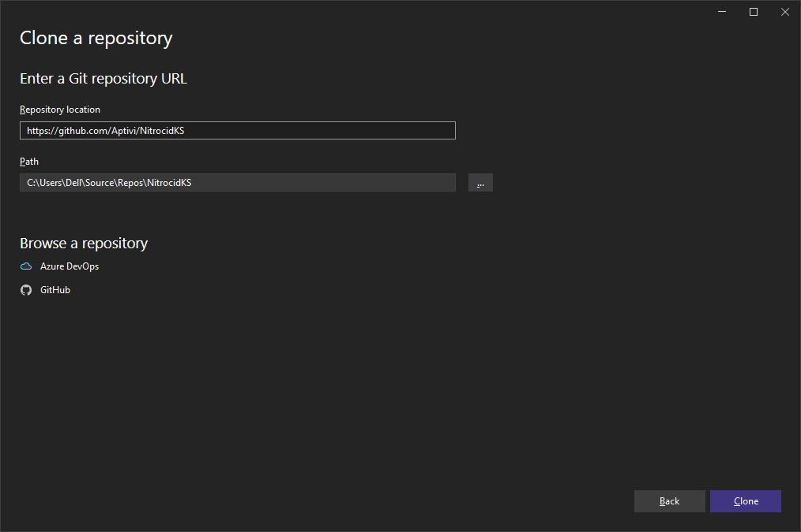

# 🪟 Building on Windows

In Windows systems, you have two ways to build the simulator: one if you use Visual Studio 2019 or later, and one if you prefer doing everything via the command-line. Make sure that your computer has the following dependencies:

* [Git for Windows](https://git-scm.com/download/win)
* [.NET 6.0 SDK](https://dotnet.microsoft.com/en-us/download/dotnet/6.0)

### Visual Studio 2019+

Before being able to build Nitrocid KS, please make sure that you have at least Visual Studio 2019 version 16.8 or later that supports building projects for .NET 6.0. You can get Visual Studio [here](https://visualstudio.microsoft.com/).

Once you have Visual Studio installed with at least the .NET 6.0 SDK and the .NET development workload, follow these steps:

1. Open Visual Studio and press `Clone Repository`
2.  In the repository location field, write `https://github.com/Aptivi/NitrocidKS.git`

    <figure><figcaption></figcaption></figure>
3. Press `Clone`. The clone may need to take a few minutes depending on your Internet connection.
4.  Press `Solution Explorer` » `Switch Views`

    <figure><figcaption></figcaption></figure>
5.  Press `Start` or press `Build` » `Build Solution`

    <figure><figcaption></figcaption></figure>
6.  Navigate to the build output folder, `KSBuild`, and start `Nitrocid.exe`

    <figure><figcaption></figcaption></figure>

### Using the command-line

If you are a hardcore command-line user or if you prefer using the command-line, follow these steps to build Nitrocid KS right from the command line:

1. Open `Git Bash` on your work directory
2. Execute `git clone https://github.com/Aptivi/NitrocidKS.git`
3. Navigate to the cloned repository, `NitrocidKS`
4. Execute `dotnet restore` and `dotnet build`
5. After building is done, run `dotnet run`
