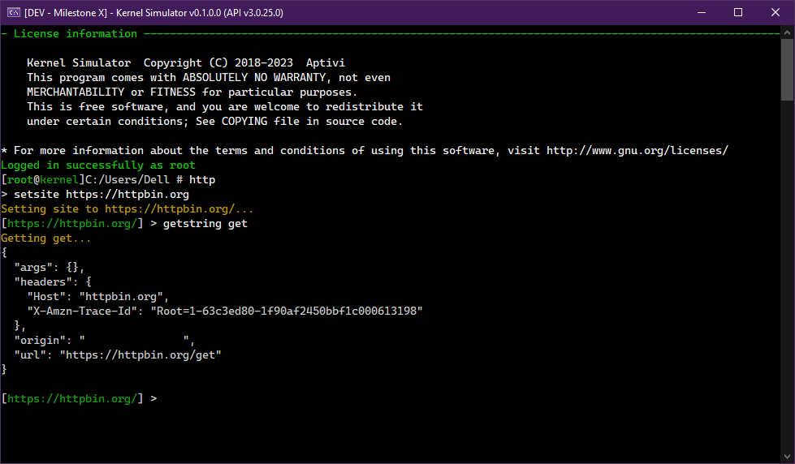

# 🌐 HTTP Client

<figure><figcaption></figcaption></figure>

Hypertext Transfer Protocol (HTTP) is an application layer protocol in the Internet protocol suite model for distributed, collaborative, and hypermedia information systems. HTTP is the foundation of data communication for the World Wide Web, where hypertext documents include hyperlinks to other resources that the user can easily access, for example by a mouse click or by tapping the screen in a web browser.

The simulated kernel attempts to provide the request functionalities for the entire HTTP protocol by giving you the HTTP client, which is just a shell with HTTP request commands.

## Connecting to an HTTP server

To be able to use the below commands that are listed in the below section, you have to be connected to an HTTP server by following the below instructions:

1. Open the HTTP shell by invoking the `http` command
2. Use the `setsite` command to point to the target host that hosts the HTTP server
   * Usage: `setsite <host>`
3. Now, execute any of the below request commands to interact with the server

## Commands

This HTTP shell provides you with these commands to choose how to interact with the HTTP server, like getting a string request from the server.

* `delete <request>`
  * Deletes a resource from the HTTP server
* `get <request>`
  * Gets the response from the HTTP server with the request
* `getstring <request>`
  * Gets the stringified response from the HTTP server with the request
* `putstring <request> <string>`
  * Puts the string to the HTTP server with the request
* `setsite <uri>`
  * Sets the target server to interact with
