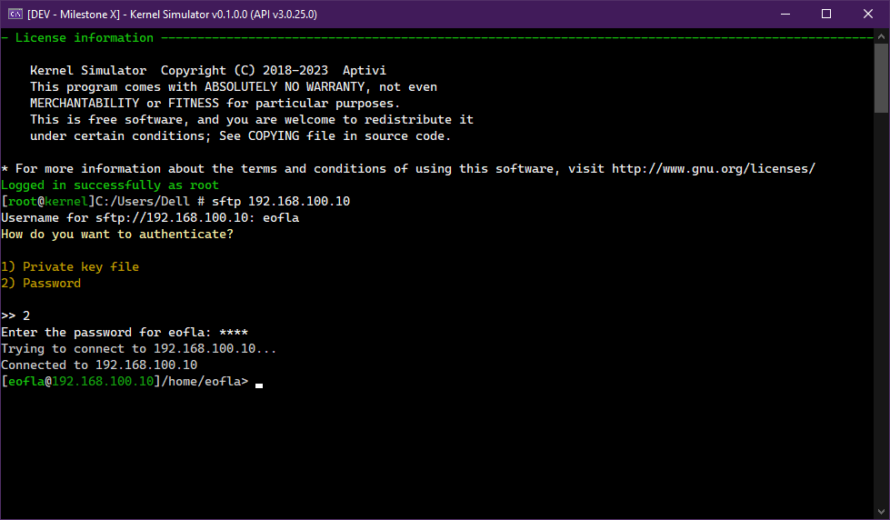

# 🔒 SFTP Client

<figure><figcaption></figcaption></figure>

This protocol is a modern file transfer protocol that is implemented as part of the Secure SHell (SSH) protocol version 2.0 engineered by the Internet Engineering Task Force (IETF). It allows secure file transfers from the client to the server and from the server to the client.

## How to connect

To connect the client to the SFTP server, you have two ways to initiate a connection to the server, which is connecting directly from the main shell, and connecting inside the SFTP shell.

### Connecting to SFTP from UESH

To connect directly from UESH, please follow the steps:

1. Use the `sftp <server>` command
2. Authenticate using your username and your password or your private key
3. You're connected!

### Connecting to SFTP inside the SFTP shell

To connect to your SFTP server inside the SFTP shell, please follow the steps:

1. Use the `sftp` command
2. Now, execute the `connect <server>` command
3. Authenticate using your username and your password or your private key file
4. You're connected!

## Commands

<figure><figcaption></figcaption></figure>

These below commands are used to perform operations on your SFTP server, but the commands found in the bottom of the list are administrative commands. Such commands need an authenticated account with the permissions for performing the operations committed by these commands.

### Normal commands

* `cdl <directory>`
  * Changes the local working directory. The folder should exist in your computer.
* `cdr <directory>`
  * Changes the remote working directory. The folder should exist in your FTP server.
* `disconnect [-f]`
  * Disconnects your client from your SFTP server
* `get <file> [output]`
  * Download a remote file from your SFTP server to the local directory
* `lsl [-showdetails|-suppressmessages] [dir]`
  * Lists the directory contents from either your current working local directory or a specified local folder
* `lsr [-showdetails] [dir]`
  * Lists the directory contents from either your current working remote directory or a specified remote folder
* `pwdl`
  * Gets the current working local directory
* `pwdr`
  * Gets the current working remote directory
* `quickconnect`
  * Opens the connection selection to connect to your FTP server quickly

### Administrative commands

* `del <file>`
  * Deletes a file from the remote server
* `put <file> [output]`
  * Uploads the entire local file to the FTP server in the current working remote directory
